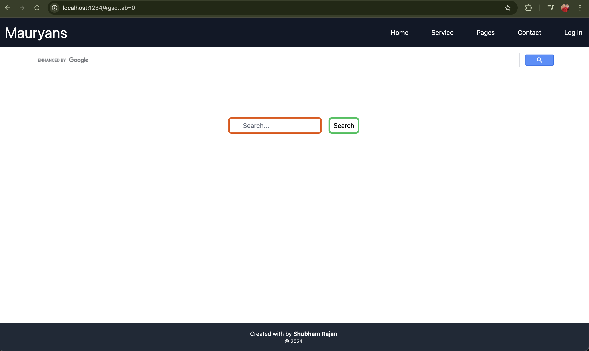
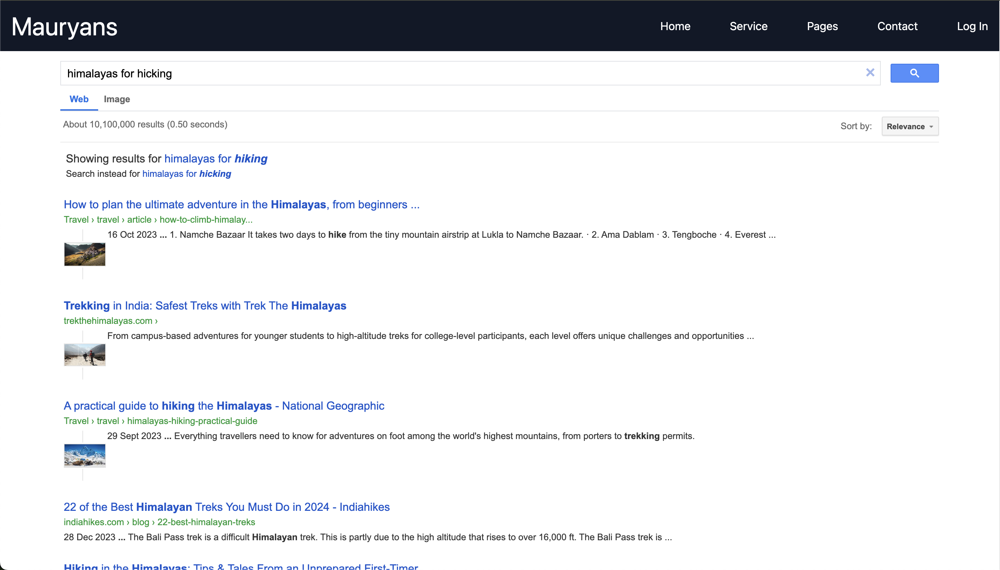
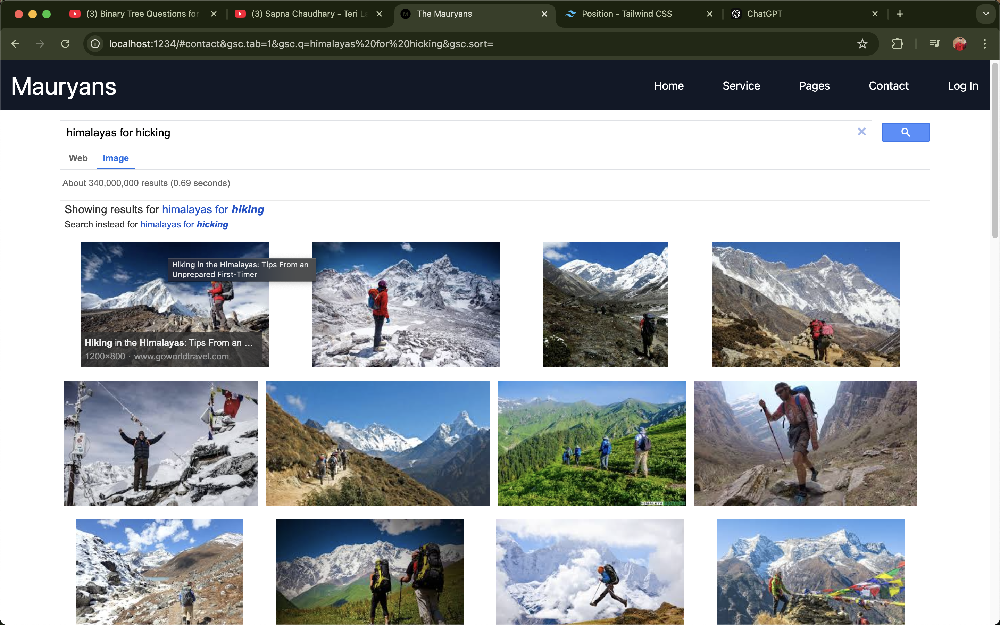
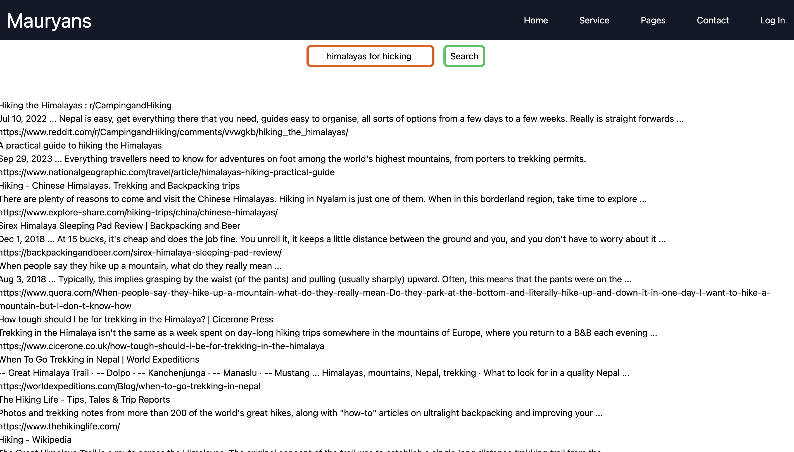

# The Mauryans
##### Till Now :-
###### Coustom Search
###### enhansed by Google
###### Google Coustom Search Box
###### Google Coustom Search API (JSON API)

  
   
  <em>The Framework/Design of The WebApp</em>

  
  

